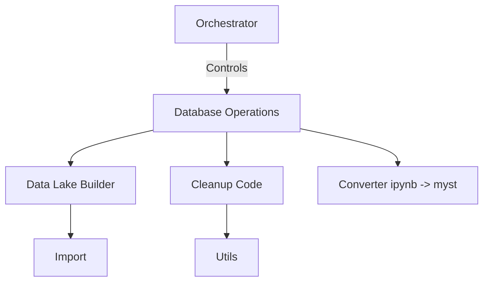
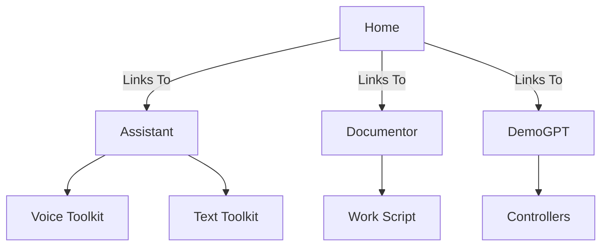

[](https://www.youtube.com/watch?v=dQw4w9WgXcQ)

[](https://xgpt.one/)

<!-- Badges -->


# xGPT.One
> Unveil the Universe of AI: Your Own AI-Driven Sidekick at Your Fingertips!

## Table of Contents
- [xGPT.One](#xgptone)
  - [Table of Contents](#table-of-contents)
  - [Features](#features)
    - [AI Assistant](#ai-assistant)
    - [Database](#database)
    - [Documentor](#documentor)
    - [Demo GPT | https://github.com/melih-unsal/DemoGPT | fully-implemented + extra](#demo-gpt--httpsgithubcommelih-unsaldemogpt--fully-implemented--extra)
    - [File Manager](#file-manager)
  - [Motivation](#motivation)
  - [Installation](#installation)
    - [Prerequisites](#prerequisites)
    - [Configuration](#configuration)
  - [User Guide](#user-guide)
  - [Folder Structure](#folder-structure)
    - [README.md](#readmemd)
- [Project Name](#project-name)
  - [Table of Contents](#table-of-contents-1)
  - [Introduction](#introduction)
  - [Core Components](#core-components)
  - [Apps](#apps)
    - [Database App](#database-app)
    - [Streamlit App](#streamlit-app)
  - [Configuration Files](#configuration-files)
  - [Scripts](#scripts)
  - [Documentation](#documentation)
  - [Helper Tools](#helper-tools)
  - [For Developers](#for-developers)
  - [Technologies Used](#technologies-used)
  - [Contributions](#contributions)
  - [License](#license)
- [Install Git Large File Storage](#install-git-large-file-storage)
  - [Platform navigation](#platform-navigation)
  - [Further reading](#further-reading)
- [Datasets:](#datasets)
- [Prompts:](#prompts)

## Features
💡 Unleash the power of AI with these robust features:

### AI Assistant
- Get 24/7 help with real-time AI assistance.
- Voice and text support with integrated voice_toolkit and text_toolkit components.

### Database
- Build and manage your data lake efficiently.
- Easily transform code files into markdown documentation with utilities like `convert_py_to_md`.
  
### Documentor 
- Automate the process of documentation and reporting.
- Utilizes advanced AI algorithms to summarize and classify documents.
  
### Demo GPT | https://github.com/melih-unsal/DemoGPT | fully-implemented + extra
- Experiment with GPT models through interactive demos and custom task chains.
- Incorporates pre-defined task chains for various use-cases like Q&A, summarization, and more.
  
### File Manager 
- Efficiently manage your files with a user-friendly interface.
  


## Motivation
Embark on an AI-driven journey with xGPT.One. Perfect for data analysis, software development, and more. Become a pioneer in the AI frontier!

> "In the era of data, xGPT.One is your starship to navigate the universe of AI."

## Installation
### Prerequisites
- OpenAI API Key (Paid version)
- Python 3.11 or higher
- Docker and Docker-compose

### Configuration
1. Clone the repository: `git clone https://github.com/xGPT-One/xGPT-One.git`
2. Update `.env` based on `one.template.env`.
3. Run the main script: `./main.sh` and select `1` for quickstart with production.

## User Guide
Detailed instructions can be found [here](docs/USER_GUIDE.md).

## Folder Structure
```
.
├── LICENSE
├── README.md
├── main.sh
├── .vscode/
│   └── settings.json
├── 
│   ├── config_loader.py
│   ├── __init__.py
│   └── resources/
│       └── images/
│           ├── ai-2.gif
│           └── ai-1.gif
├── docs/
│   ├── todo.DevNotes.md
│   ├── Custom_themen.md
│   └── learn_material/
│       ├── annotated-text.py
│       └── ...
├── config/
│   ├── streamlit/
│   │   ├── config.toml
│   │   └── secrets.toml
│   ├── user/
│   │   └── config.yaml
│   └── global/
│       └── one.template.env
├── scripts/
│   ├── build_docker-compose.yml.py
│   └── ...
├── helper/
│   ├── summ_readme.md
│   ├── tree_info.py
│   ├── Translate/
│   │   └── translateFolder.py
│   └── pdf/
│       ├── Folder2PDF_v0.1.py
│       ├── Folder2PDF_v0.2.py
│       └── config.ini
└── apps/
    ├── __init__.py
    ├── database/
    │   ├── remove_jupyter_text.py
    │   └── ...
    └── streamlit/
       ├── home.py
       └── ...
```

Certainly, let's get started by creating a detailed and visually appealing README file. To make it more readable, especially for those who may not be tech-savvy, I'll omit less essential files like `.DS_Store` and `__init__.py`.

We can also use Markdown to add some basic color highlighting to differentiate between different parts of the project.

### README.md

---

# Project Name

## Table of Contents
1. [Introduction](#introduction)
2. [Core Components](#core-components)
3. [Apps](#apps)
4. [Configuration Files](#configuration-files)
5. [Scripts](#scripts)
6. [Documentation](#documentation)
7. [Helper Tools](#helper-tools)
8. [Development](#development)

---

## Introduction
This project aims to provide an all-in-one solution for XYZ. It has a variety of applications and utilities that make it easier to work with AI tools.

---

## Core Components

The `` directory houses the essential components for the project.

- **`config_loader.py`**: Loads configurations for the project.

  ```mermaid
  graph TD
  A[Config Loader] --> B[User Config]
  A --> C[Streamlit Config]
  B -.-> D[Global Config]
  C -.-> D
  ```

- **`resources/`**: Contains resources like images used in the project.

- **`utils/`**: Miscellaneous utility functions.

---

## Apps

### Database App



- **`database/`**: Manages the data lake and database operations.
    - `orchestrator.py`: Central controller for database operations.
    - `build_data_lake.py`: Builds the data lake.
    - `cleanup_code.py`: Cleans up the code.
    - `convert_ipynb_to_myst.py`: Converts Jupyter notebooks to MyST (Markdown).

### Streamlit App



- **`streamlit/`**: Contains the Streamlit app for interactive web-based tools.
    - `home.py`: The home page of the Streamlit app.
    - `assistant/`: Provides voice and text-based assistance.
    - `documentor/`: Documentation automation tools.
    - `demogpt/`: Interface for GPT-based demos.

---

## Configuration Files

- **`config/`**: Houses all the configuration files.
    - `streamlit/`: Configuration for Streamlit apps.
    - `user/`: User-specific configuration.
    - `global/`: Global configuration files.

---

## Scripts

- **`scripts/`**: Contains scripts for automation and setup.
    - `build_docker-compose.yml.py`: Builds the Docker Compose file.
    - `cleanup_and_run.sh`: Cleanup and run script.
    - `docker_streamlit.sh`: Docker setup for Streamlit.

---

## Documentation

- **`docs/`**: Contains all the project documentation.
    - `todo.DevNotes.md`: Developer notes and TODOs.
    - `Custom_themen.md`: Guide on custom themes.
    - `learn_material/`: Various Streamlit and Python learning materials.

---

## Helper Tools

- **`helper/`**: Contains helper tools and utilities.
    - `summ_readme.md`: Summarized readme.
    - `tree_info.py`: Generates a tree view of the folder structure.

---

## For Developers
Want to contribute? Read our [Developer Guide](docs/DEVELOPER_GUIDE.md).
- **`.vscode/`**: Contains settings for VSCode.
    - `settings.json`: Custom settings for VSCode.

## Technologies Used
- 🎨 Front-end: Streamlit
- 🐍 Back-end: Python
- 🐳 Deployment: Docker
- 🤖 AI Model: OpenAI GPT-3

## Contributions
We welcome contributions from everyone. Feel free to open an issue or create a pull request.

## License
This project is licensed under the MIT License.

⭐️ From [xGPT.One Team](https://github.com/xGPT-One)


[LLM Leaderboard](https://huggingface.co/spaces/HuggingFaceH4/open_llm_leaderboard)

# Install Git Large File Storage

In order to use Git LFS, you need to download and install a new program different from Git.

## Platform navigation

- [Mac](https://docs.github.com/zh/repositories/working-with-files/managing-large-files/installing-git-large-file-storage?platform=mac)
- [Windows](https://docs.github.com/zh/repositories/working-with-files/managing-large-files/installing-git-large-file-storage?platform=windows)
- [Linux](https://docs.github.com/zh/repositories/working-with-files/managing-large-files/installing-git-large-file-storage?platform=linux)

1. Navigate to git-lfs.github.com and click Download.[](https://git-lfs.com)****
   
   - **Tip:** To learn more about optional methods to install Git LFS for Windows, please see this [getting started guide](https://github.com/github/git-lfs#getting-started).
   
2. On your computer, find the downloaded file.
   
3. Double-click the file git-lfs-windows-1.X.X.exe, where 1.X.X is replaced by the version of Git LFS you downloaded. When you open this file, Windows will run the installation wizard to install Git LFS.

4. Open the terminal or Git Bash. Given the installation wizard might have modified the system `PATH`, starting a new session ensures that Git can find Git LFS.

5. Verify successful installation:
   
   ```shell
   $ git lfs install
   > Git LFS initialized.
   ```

6. If a success message for `git lfs install` does not appear, please contact [GitHub Support](https://support.github.com/contact?tags=docs-generic). Make sure to include the name of your operating system.

1. Navigate to git-lfs.github.com and click Download.[](https://git-lfs.com)****

   - **Tip:** To learn more about optional methods to install Git LFS for Linux, please see this [getting started guide](https://github.com/github/git-lfs#getting-started).

2. On your computer, locate and unzip the downloaded file.

3. Open the terminal or Git Bash.

4. Change the current working directory to the folder you downloaded and unzipped.
   
   ```shell
   cd ~/Downloads/git-lfs-1.X.X
   ```
   
   **Note:** The file path used after `cd` depends on your operating system, the version of Git LFS you downloaded, and the location where you saved the Git LFS download.

5. To install this file, run the following command:
   
   ```shell
   $ ./install.sh
   > Git LFS initialized.
   ```
   
   **Note:** You may have to use `sudo ./install.sh` to install this file.

6. Verify successful installation:
   
   ```shell
   $ git lfs install
   > Git LFS initialized.
   ```

7. If a success message for `git lfs install` does not appear, please contact [GitHub Support](https://support.github.com/contact?tags=docs-generic). Make sure to include the name of your operating system.

## [Further reading](https://docs.github.com/zh/repositories/working-with-files/managing-large-files/installing-git-large-file-storage#further-reading)

- "[Configuring Git Large File Storage](https://docs.github.com/zh/repositories/working-with-files/managing-large-files/configuring-git-large-file-storage)"
```

Please note that the translation might not be 100% contextually accurate as a native speaker might phrase things, but I've tried to ensure the clarity and correctness of the content.

# Datasets:
 - https://www.kaggle.com/


# Prompts:
- https://flowgpt.com/
- 

----

