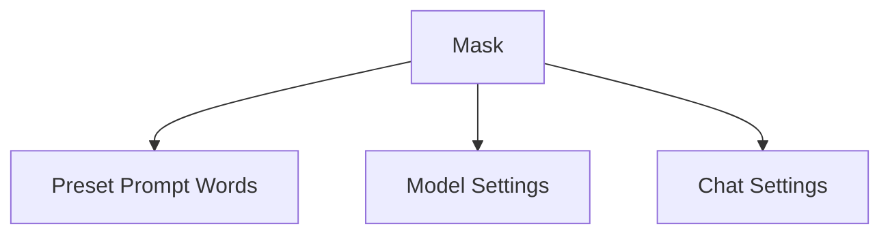

Here's the improved version of the provided Markdown, with a more professional structure, clearer explanations, and an included mermaid diagram:

# xGPT-Assistants

## Features Overview

- **Markdown Support**: Comprehensive support including LaTex formulas, Mermaid flowcharts, and code highlighting.
- **Fast Loading**: Approximately ~100kb initial screen loading with streaming response capability.
- **Privacy-first**: All user data is stored locally within the browser.
- **Role Functionality**: Preset roles (mask) for easy creation, sharing, and debugging of personalized dialogues.
- **Built-in Prompts**: Extensive prompt list sourced from [Awesome ChatGPT Prompts](https://github.com/f/awesome-chatgpt-prompts).
- **Efficient Token Management**: Auto-compression of chat history to optimize token usage without compromising extended dialogue capabilities.

## User Guide

### Masks

#### Understanding Masks

- **Preset Prompt Words (Contextual Prompts)**: Used in In-Context Learning to guide ChatGPT outputs, introduce constraints, or provide additional knowledge.
- **Model Settings**: Default model parameters for dialogues initiated with the given mask.
- **Chat Settings**: A collection of settings enhancing the chat experience.

#### Adding Preset Masks

For now, masks can only be added by modifying the source code:

1. Set up a mask using ChatGPT Next Web.
2. Download the mask as a JSON via the mask editing page.
3. Format the JSON file into the corresponding `.ts` code with ChatGPT's help.
4. Integrate it into the respective `.ts` file.

> **Note**: Future updates will introduce a method for side-loading masks.

### Chat Interface

#### Button Functions

Hover over each button to view its description:

- **Chat Settings**: View or modify current chat settings. For details on its interplay with global settings, see the section below.
- **Color Theme**: Toggle between auto, dark, and light modes.
- **Shortcut Commands**: Utilize built-in shortcuts for preset prompts or use `/` in chat for quick access.
- **All Masks**: Navigate to the mask page.
- **Clear Chat**: Implement a clear marker. Chats above the marker won't be transmitted to GPT, functioning like a chat reset. Click again to revoke.
- **Model Settings**: Modify the model for the ongoing chat. This does not alter the global default model.

#### Chat vs. Global Settings

Settings can be accessed from:

1. The button at the bottom-left for global settings.
2. The button above the chat box for chat-specific settings.

By default, a new chat inherits its settings from global settings. If global settings are changed, they will synchronize with the settings of any new chat. Manual changes to chat settings will decouple it from global updates. To re-synchronize, enable the "Use Global Settings" in chat settings.

#### Understanding Chat Settings

Accessed via the button above the chat:

- **Preset Prompt List**: Manage preset prompts.
- **Character Avatar & Name**: Customize character attributes.
- **Hide Preset Dialogues**: Opt to display preset prompts within the chat interface.
- **Use Global Settings**: Toggle between local and global chat settings.
- **Model Setting Options**: These mirror the global settings. See the next section for details.

#### Global Settings Explained

- ChatGPT parameters (`model`, `temperature`, `top_p`, `max_tokens`, `presence_penalty`, `frequency_penalty`): Refer to OpenAI's official documentation.
- **Number of Recent Messages**: Defines how many recent messages are attached with a user's new input.
- **Message Length Compression Threshold**: Auto-trigger for the history summary function upon reaching a word count.
- **History Summary**: Toggle the history summary feature.

#### The Concept of History Summary

A mechanism to preserve context in extended conversations, the history summary (or compression) ensures the conversation remains within the ChatGPT API's token limit (e.g., 4096 tokens for the 3.5 model). To manage lengthy histories, the function compresses chats exceeding a set threshold (e.g., 1000 characters) into a concise 100-word summary.

> **Note**: It's a lossy compression suitable for most, but not all, scenarios.

#### When to Disable History Summary?

Turn it off for one-off tasks like translation or data extraction. Set the historical message count to 0 for these use-cases.

#### What's Transmitted with a User Message?

A user's input to ChatGPT consists of:

1. **System-level Prompts**: Mimics the official ChatGPT WebUI experience.
2. **History Summary**: Provides long-term but generalized context.
3. **Preset Prompts**: Used for In-Context Learning or to introduce system-level constraints.
4. **Recent Chat Records**: Acts as short-term memory offering precise context.
5. **User's Current Input**.
