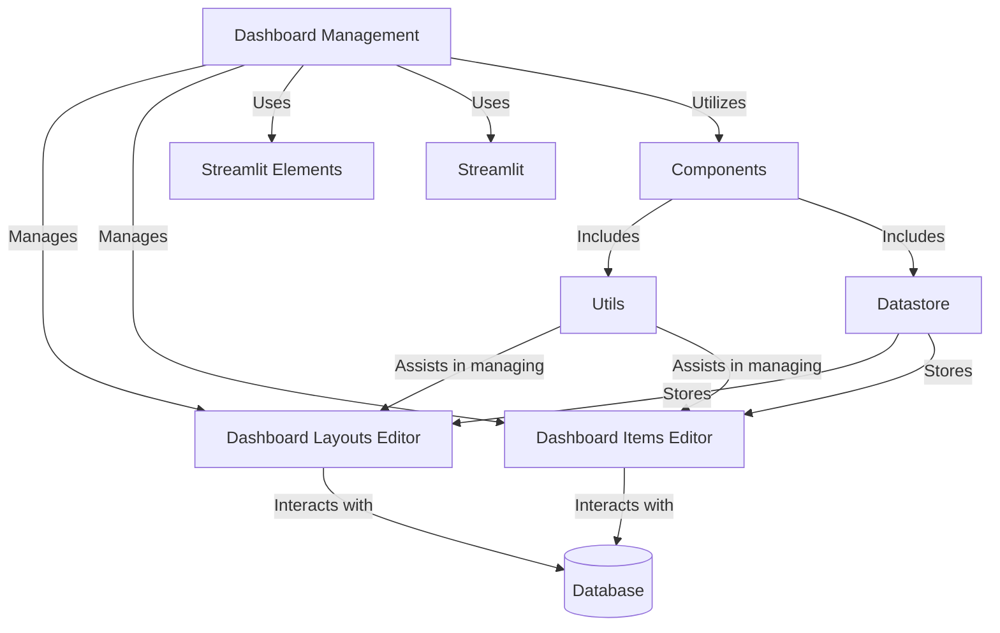
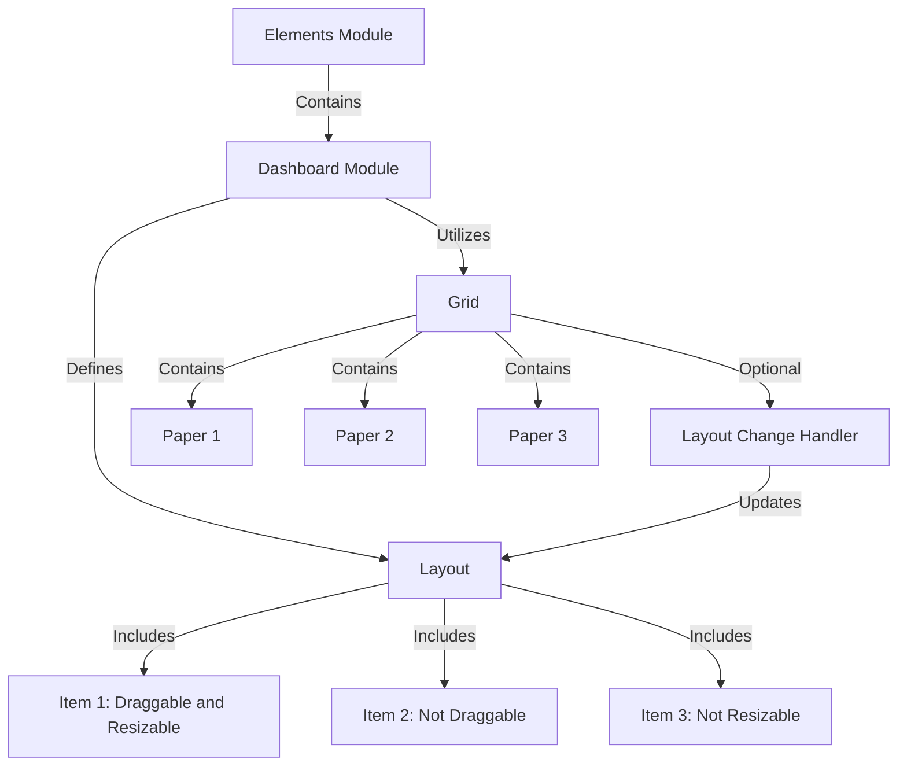
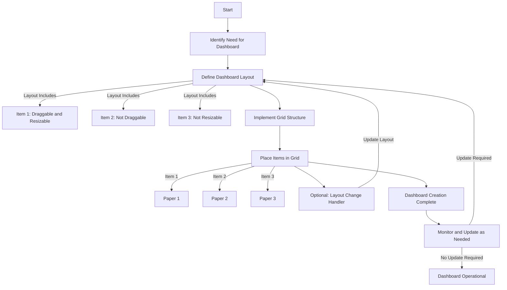
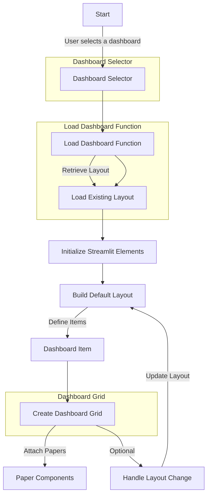

# Workflow of the Dashboard Manager

# Logic of Dashboard build

### process and components of the dashboard when it is needed, created, or updated

# Dashboard testing setup

This diagram illustrates the following process:

1. **Start**: The process begins with the user selecting a dashboard.
2. **Dashboard Selector**: The user's selection triggers the `load_dashboard` function.
3. **Load Dashboard Function**: This function loads the existing layout for the selected dashboard.
4. **Initialize Streamlit Elements**: Streamlit Elements are initialized for dashboard creation.
5. **Build Default Layout**: A default layout is built with specified dashboard items.
6. **Dashboard Item**: Individual items are defined for the dashboard.
7. **Create Dashboard Grid**: A grid layout is created to place the dashboard items.
8. **Paper Components**: Paper components are attached to the grid.
9. **Handle Layout Change (Optional)**: Optionally, any layout changes made by the user can be handled and used to update the layout.
