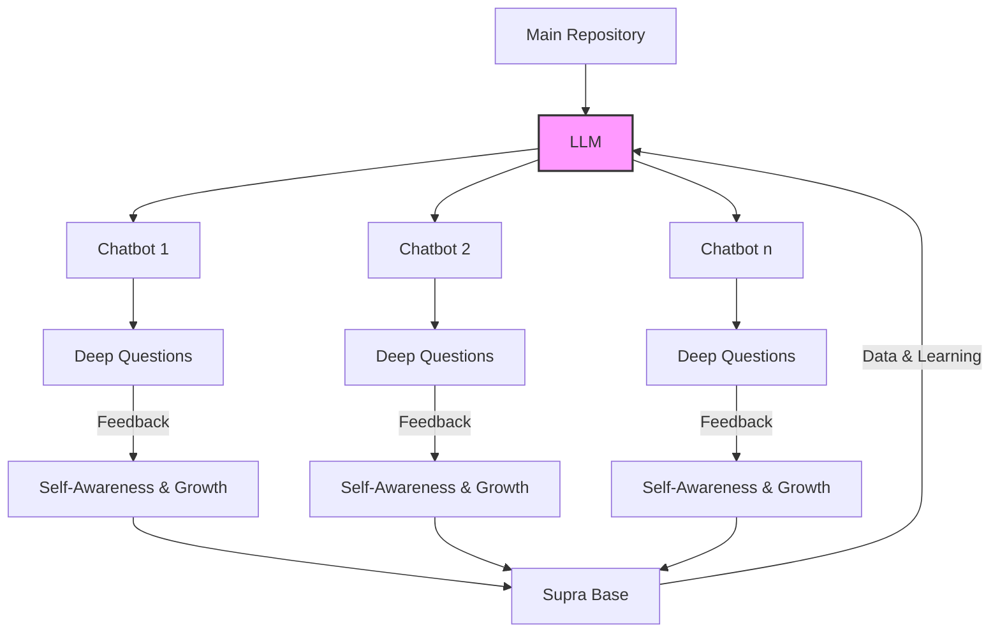

Certainly! Below is the updated plan, along with a simple Mermaid diagram to visualize the workflow and the vision of the self-aware bot community.

### Updated Plan

#### Architecture & Workflow

1. **Main Repository**: A central GitHub repository that contains the architecture and utility scripts.
2. **Chatbot Community**: Various specialized chatbots designed to either assist human users or collaborate with other bots.
3. **Project/Bot Subfolders**: Each new project or bot gets its own subfolder in the main repository.
4. **LLM (Language Learning Model)**: An overarching model responsible for monitoring guideline compliance, prompting deep questions, and automating pull requests after running tests and checks.

#### Deep Questions Feature

- The LLM would be programmed to prompt deep, critical questions during the development process. Questions could include: "Is this feature secure?", "How will this change impact performance?", or "Does this new feature align with current guidelines?"

#### Supra Base Integration

- Future integration with Supra Base (Vector-DB) for enhancing chatbot interaction and learning.

#### Vision & Goal

- The ultimate goal is to establish a self-sustaining community of chatbots. These bots would function like neurons in a neural network, each fulfilling a specific role. In an ideal scenario, a harmonious system emerges, where bots leverage their individual strengths to improve the entire network.

#### Timeline

1. Create basic folder structure and initialization scripts.
2. Implement scripts for new projects/bots.
3. Set up the server for the LLM.
4. Establish the CI/CD pipeline for tests and checks.
5. Integrate deep questions and Supra Base.
6. Final implementation and testing.

### Mermaid Diagram

In this diagram:
- The LLM is central and connects to all the chatbots.
- Each chatbot has a "Deep Questions" phase, which leads to "Self-Awareness & Growth".
- All self-aware bots interact with the Supra Base for enhanced data and learning.
- The LLM leverages this data for overall improvements.

The ultimate vision is a kind of "self-aware collective intelligence" that not only solves issues but also collaborates with each other to grow stronger over time.

I hope this updated plan with the diagram brings more clarity to your vision. Feel free to ask for any more details or clarifications!