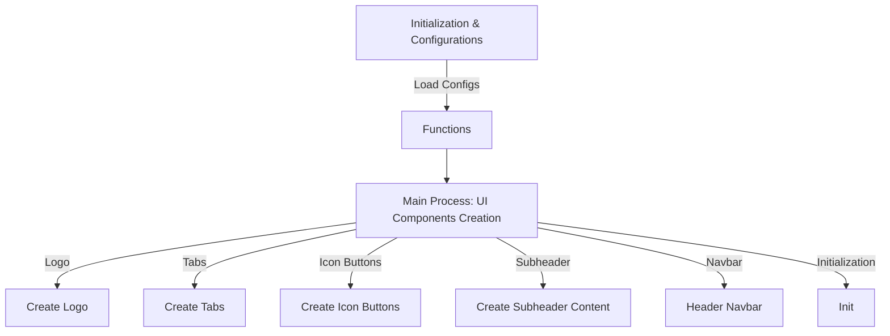

### 1. Workflow and Explanation

**Initialization and Configurations**

- **Purpose**: Initializes constants, loads configuration files, and sets up global variables.
- **Workflow**:
  - **Constants**: `LOGO_PATH` and `CONFIG_PATHS` define file paths for resources and configurations.
  - **Loading Configurations**: Iterates over `CONFIG_PATHS` to load JSON configurations into the `configs` dictionary.
  - **Deconstructing Configs**: Splits the `configs` dictionary into individual variables for easy access.

**Functions (Helper Functions)**

- **load_config**: Loads configuration from a JSON file. Handles errors during file loading.
- **check_for_logo_image**: Checks for the existence of the logo image and loads it if available.
- **change_page_extended**: Changes the current page and manages `st.session_state`.
- **update_menu** & **update_submenu**: Updates the session state to reflect active menu or submenu items.
- **check_active_color**: Determines the active color for UI elements based on session state.

**Main Process (UI Components Creation)**

- **create_logo**: Displays the logo using Material UI.
- **create_tabs**: Generates tabs for the header based on `menu_config`.
- **create_icon_buttons**: Creates icon buttons for the header.
- **create_subheader_content**: Generates subheader content based on configuration.
- **subheader_navbar**: Manages the subheader navigation bar.
- **header_navbar**: Assembles the complete header navbar with logo, tabs, and icon buttons.
- **init**: Initializes the menu creation process for a given page.

### 2. Location Guide

- **Configuration Loaders**: Located at the start of the file under _Initialization & Configurations_.
- **Helper Functions**: Defined under `# ? Helper functions`.
- **UI Component Functions**: Found under `# ^ MAIN PROCESS`, with each function creating a different part of the UI.

### 3. Possible and Known Issues

- **Error Handling**: While the code includes error handling for configuration loading, it might not cover all edge cases.
- **Path Dependencies**: The file paths are relative and might cause issues if the directory structure changes.
- **UI Responsiveness**: Depending on the complexity of the UI, there might be performance implications.

### 4. Mermaid Diagrams

Given the complexity and the specific nature of the code, detailed Mermaid diagrams for each section might be extensive. Instead, I suggest a high-level diagram to represent the overall structure and flow of this file:

