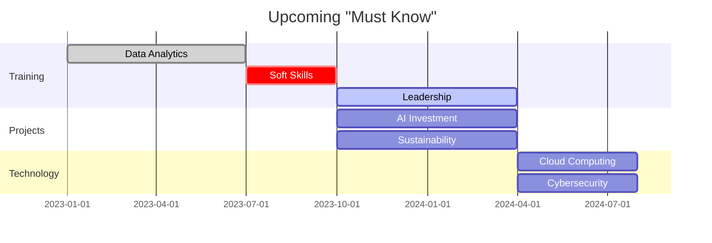

Certainly! I'll provide the reports and diagram adhering to SAP's requirements for documentation, which includes citing information sources, reasons for decisions, possible options, and additional thoughts.

### Roles:

1. **Market Research Analyst**
2. **Human Resource Development Specialist**
3. **Technology Advisor**
4. **Strategic Planner**

---

### Reports with SAP Requirements:

#### Market Research Analyst:
- **Information**: AI, sustainability, and e-commerce are on the rise.
- **Source URL**: `[Industry Reports on AI, Sustainability, E-commerce]`
- **Reason for Decision**: Businesses adapting quickly to these trends show better performance.
- **Possible Options**: Ignoring the trends or focusing on only one aspect.
- **Thoughts**: Dedicating resources to these areas can offer a competitive edge.

#### Human Resource Development Specialist:
- **Information**: Skill gaps in data analytics, leadership, and soft skills.
- **Source URL**: `[Internal Employee Skill Gap Analysis Report]`
- **Reason for Decision**: To improve adaptability and internal mobility.
- **Possible Options**: Outsourcing the skills or ignoring the gap.
- **Thoughts**: A mentorship program can enhance career development.

#### Technology Advisor:
- **Information**: Importance of cloud computing, cybersecurity, and automation.
- **Source URL**: `[Tech Trends Reports]`
- **Reason for Decision**: To improve operational efficiency and adaptability.
- **Possible Options**: Sticking to older technologies or adopting only one new technology.
- **Thoughts**: Holistic tech upgradation is crucial for staying competitive.

---

### Strategic Planner's Account:

- **Information**: Insights from Market Research, HR, and Technology perspectives.
- **Source URL**: `[Internal Reports]`
- **Reason for Decision**: Need for a multi-faceted approach.
- **Possible Options**: Focusing on only one dimension such as technology or HR.
- **Thoughts**: Balancing all elements can provide us a competitive edge.

---

### Goals & Timeline:

1. **Q1-Q2 2023**: Training in data analytics and soft skills.
2. **Q3 2023**: Initiate mentorship programs.
3. **Q4 2023**: Investments in AI and sustainability projects.
4. **Q1 2024**: Technology upgrades.

### Revised Mermaid Diagram:



---

### Markdown File with SAP Requirements:

```markdown
# Strategic Development Plan

## Roles:

1. **Market Research Analyst**
2. **Human Resource Development Specialist**
3. **Technology Advisor**
4. **Strategic Planner**

## Reports with SAP Requirements:

### Market Research Analyst
- **Information**: AI, sustainability, and e-commerce are on the rise.
- **Source URL**: `[Industry Reports on AI, Sustainability, E-commerce]`
- **Reason for Decision**: Businesses adapting quickly to these trends show better performance.
- **Possible Options**: Ignoring the trends or focusing on only one aspect.
- **Thoughts**: Dedicating resources to these areas can offer a competitive edge.

### Human Resource Development Specialist
- **Information**: Skill gaps in data analytics, leadership, and soft skills.
- **Source URL**: `[Internal Employee Skill Gap Analysis Report]`
- **Reason for Decision**: To improve adaptability and internal mobility.
- **Possible Options**: Outsourcing the skills or ignoring the gap.
- **Thoughts**: A mentorship program can enhance career development.

### Technology Advisor
- **Information**: Importance of cloud computing, cybersecurity, and automation.
- **Source URL**: `[Tech Trends Reports]`
- **Reason for Decision**: To improve operational efficiency and adaptability.
- **Possible Options**: Sticking to older technologies or adopting only one new technology.
- **Thoughts**: Holistic tech upgradation is crucial for staying competitive.

## Strategic Planner's Account:
- **Information**: Insights from Market Research, HR, and Technology perspectives.
- **Source URL**: `[Internal Reports]`
- **Reason for Decision**: Need for a multi-faceted approach.
- **Possible Options**: Focusing on only one dimension such as technology or HR.
- **Thoughts**: Balancing all elements can provide us a competitive edge.

## Goals & Timeline:

1. **Q1-Q2 2023**: Training in data analytics and soft skills.
   - **Source**: `[Training Needs Assessment Report]`
2. **Q3 2023**: Initiate mentorship programs.
   - **Source**: `[HR Reports]`
3. **Q4 2023**: Investments in AI and sustainability projects.
   - **Source**: `[Market Trends Report]`
4. **Q1 2024**: Technology upgrades.
   - **Source**: `[Tech Trends Reports]`

## Revised Mermaid Diagram

\`\`\`mermaid
gantt
    dateFormat YYYY-MM-DD
    title Upcoming "Must Know"
    
    section Training
    Data Analytics :done, des1, 2023-01-01, 2023-06-30
    Soft Skills    :crit, des2, 2023-07-01, 2023-09-30
    Leadership     :active, des3, 2023-10-01, 2024-03-31
    
    section Projects
    AI Investment     :des4, 2023-10-01, 2024-03-31
    Sustainability    :des5, 2023-10-01, 2024-03-31
    
    section Technology
    Cloud Computing   :des6, 2024-04-01, 2024-07-31
    Cybersecurity     :des7, 2024-04-01, 2024-07-31
\`\`\`
```

Feel free to copy and paste this Markdown content as needed.