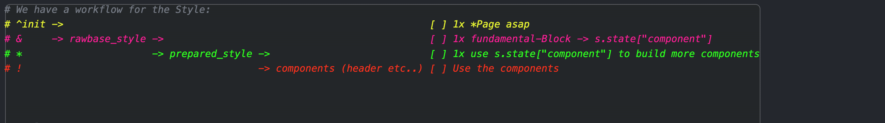

```mermaid
    flowchart TB
        start(Start) --> init[Initialization]
        init --> load_configs[Load Configurations]
        load_configs --> style[Load Styling JSON]
        style -->|Define Styles| header_elements[Header Elements]
        header_elements --> logo[Create Logo]
        header_elements --> tabs[Create Tabs]
        header_elements --> icon_buttons[Create Icon Buttons]
        header_elements --> subheader_buttons[Create Subheader Buttons]
        header_elements -->|Render Elements| end[End]
```

